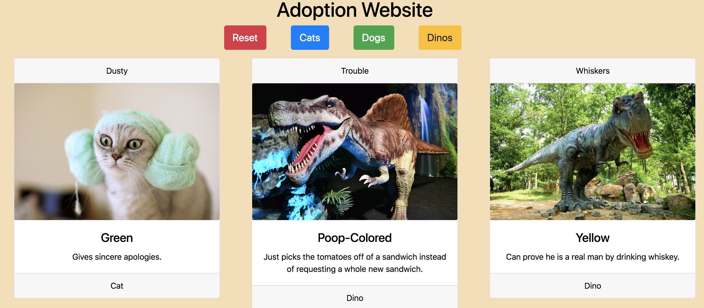

# Adoption Website

## Technologies Used:

 * HTML5 
 * CSS 
 * JavaScript 
 * Bootstrap 4 
 * ES6 Modules
 * jQuery

## Description 

We displayed three category(type) buttons printed at the top of the page. Each button is a different color. They are hard-coded. You can click one of the 3 buttons, then only the cards that are in the category(type) will show. The "reset" button allows you to unfilter the results.

## Screenshots

## Instructions 

1. Go to: `https://www.npmjs.com/package/http-server` and install "http-server".  
2. Navigate to the project folder in command line interface and type: `http-server -p 8080`  
3. This will show at: `http://localhost:8080` in your internet browser. 
